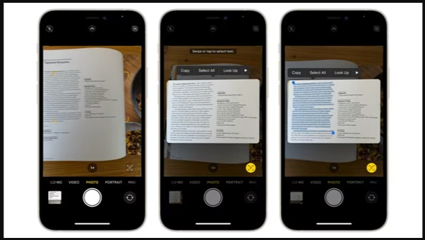

# 📸 Optical_text_extractor_from_image
🎉 EasyOCR Streamlit App: Extract text from images effortlessly using EasyOCR and Streamlit. Upload images in PNG, JPG, or JPEG formats, and let the AI do the rest! Built with Python, PIL, and NumPy, hosted on Hugging Face Spaces. Perfect for quick and accurate OCR needs. Made with ❤️ by @itsANURAG. 🚀
<p align="center">

</p>

## 📝 Overview
The EasyOCR Streamlit App allows users to upload images in PNG, JPG, or JPEG formats and extract text from them effortlessly. This tool is particularly useful for digitizing printed or handwritten text, making it searchable and editable. The application uses the EasyOCR library for text extraction and Streamlit for the interactive user interface, providing a seamless and efficient user experience.

## ✨ Features
- 📂 **Upload Images**: Supports PNG, JPG, and JPEG formats.
- 🔍 **Text Extraction**: Utilizes EasyOCR to read and extract text from images.
- 💻 **Interactive UI**: Built with Streamlit for a seamless and engaging user experience.
- ⚡ **Instant Results**: Displays extracted text in real-time.

## How modern tech-giants incorporated this:
- Apple introduced OCR functionality on iPhones with the release of iOS 15, which was announced at the Apple Worldwide Developers Conference (WWDC) in June 2021. This feature, known as "Live Text," allows users to extract text from images in real-time using the device's camera. It was one of the key features highlighted during the iOS 15 announcement and has since been available to users with compatible iPhone models.

<p align="center">

</p>

## 📽️ App Demo


## 🧠 How It Works
- **Input Image**: The process begins with an input image containing text.
- **Pre-processing**: The input image undergoes pre-processing steps, such as resizing, normalization, or noise reduction.
- **Text Detection**: EasyOCR identifies regions within the pre-processed image that potentially contain text.
- **Text Recognition**: EasyOCR performs optical character recognition (OCR) on the detected text regions to extract the textual content.
- **Post-processing**: The recognized text may undergo post-processing steps to enhance accuracy and readability.
- **Output Text**: The final output of the EasyOCR process is the extracted text from the input image.

## 🛠️ Installation
- Follow these steps to run the project locally:
### Clone the repository:
```bash
git clone https://github.com/yourusername/easyocr-streamlit-app.git
cd easyocr-streamlit-app
```
### Install the required packages:
```bash
pip install -r requirements.txt
```
### Run the Streamlit app:
```bash
streamlit run app.py
```

## 📖 Usage
- **Upload your image**: Use the file uploader to select your image.
- **Processing**: Wait for the AI to process and extract text from the image.
- **View Results**: The extracted text will be displayed on the screen, ready for you to copy or use as needed.

## 🗂️ Code Overview
- **app.py**: Contains the main application code for the Streamlit app.
- **requirements.txt**: Lists all dependencies required to run the project.
- **README.md**: Provides documentation and information about the project.

## 🤝 Contributing
I welcome contributions! If you have any ideas, suggestions, or find bugs, please open an issue or submit a pull request. Also please go ahead & fork if you like the repo!

## 🙏 Acknowledgments
❤️ Built with love by @itsANURAG
🌐 Hosted on Hugging Face Spaces 🤗
